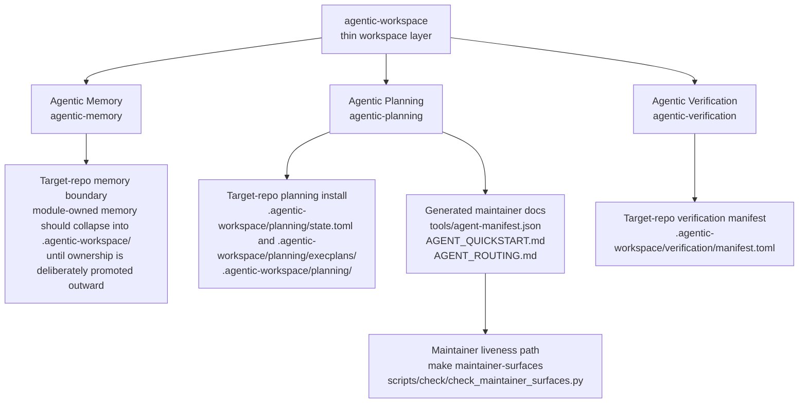

# Architecture

This page describes the current ecosystem shape. For the user-facing Agentic Workspace package hierarchy, start with [`docs/index.md`](index.md) and [`docs/package/overview.md`](package/overview.md).

Use `docs/design-principles.md` as the higher-level rule set for why this shape exists and what future changes must preserve.

## Public Shape

## Current Module Roles

- Agentic Memory owns durable repo knowledge.
- Agentic Planning owns active execution state.
- Agentic Verification owns soft verification protocols, bounded evidence records, and proof route hints.
- `agentic-workspace` coordinates module selection and shared lifecycle verbs.
- The module registry now exposes first-class capabilities, compatibility metadata, and result-contract guarantees; see `docs/module-capability-contract.md`.
- Generated docs and checks support the module and package contracts, but are not standalone products.
- The public extension boundary is still first-party only; see `docs/extension-boundary.md`.

## Monorepo Operating Boundary

In this monorepo:

- Installed planning, memory, and verification surfaces are authoritative for live monorepo operation, but the module-managed home stays concentrated under `.agentic-workspace/` and the repo-facing projection stays minimal.
- `packages/memory/`, `packages/planning/`, and `packages/verification/` are module implementation workspaces for source, payloads, tests, and fixtures.
- Module implementation directories should not grow new module-local operational installs.
- [`.agentic-workspace/docs/extraction-and-discovery-contract.md`](../.agentic-workspace/docs/extraction-and-discovery-contract.md) names the maintainer boundary between module source, payload, and the root install, and `make maintainer-surfaces` now checks that boundary directly.

## Why The Workspace Layer Stays Thin

The workspace layer exists to compose modules, not to absorb domain logic.
It should stay quiet in ordinary use: visible machinery should justify itself, and compact selectors or module-owned surfaces should carry the detail whenever they can do so safely.

Default rule:

- new module-specific lifecycle flags or domain rules should land in the module CLI first
- add them to the workspace layer only when there is a clear cross-module reason

