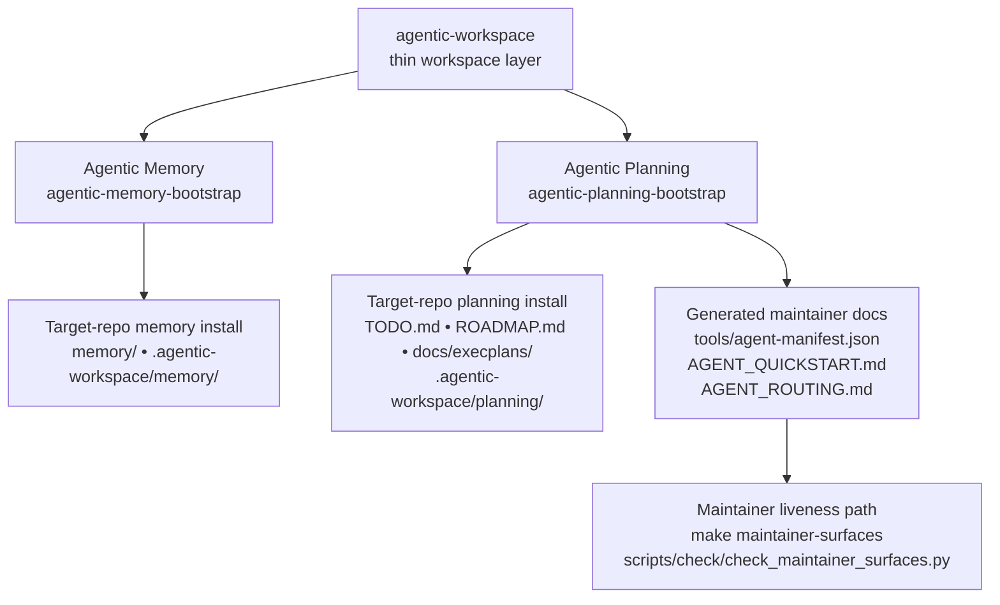

# Architecture

This page describes the current ecosystem shape.

Use `docs/design-principles.md` as the higher-level rule set for why this shape exists and what future changes must preserve.

## Public Shape

## Current Module Roles

- Agentic Memory owns durable repo knowledge.
- Agentic Planning owns active execution state.
- `agentic-workspace` coordinates module selection and shared lifecycle verbs.
- Generated docs and checks support the package contracts, but are not standalone products.

## Monorepo Operating Boundary

In this monorepo:

- Root planning and memory installs are authoritative for live monorepo operation.
- `packages/memory/` and `packages/planning/` are package workspaces for source, payloads, tests, and fixtures.
- Package directories should not grow new package-local operational installs.

## Why The Workspace Layer Stays Thin

The workspace layer exists to compose modules, not to absorb domain logic.

Default rule:

- new module-specific lifecycle flags or domain rules should land in the package CLI first
- add them to the workspace layer only when there is a clear cross-module reason
