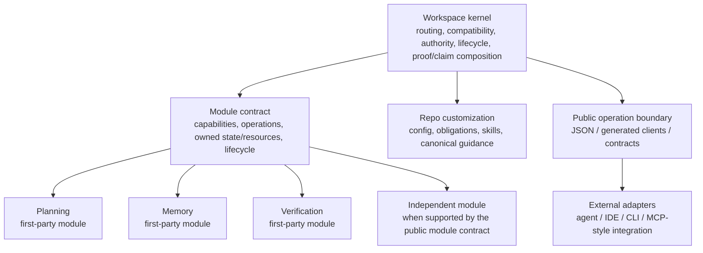

# Architecture

Agentic Workspace is designed as a small operating kernel around independently owned capabilities. The kernel provides the cross-cutting contracts that make agent work cheap to orient, continue, prove, and close; modules and host repositories keep ownership of domain meaning.

For the public product model, start with [Package overview](package/overview.md). For durable product intent, use [`SYSTEM_INTENT.md`](../SYSTEM_INTENT.md).

## Architectural shape

```mermaid
flowchart TD
    W[Workspace kernel\nrouting, compatibility, authority, lifecycle, proof/claim composition]
    MC[Module contract\ncapabilities, operations, owned state/resources, lifecycle]
    RC[Repo customization\nconfig, obligations, skills, canonical guidance]
    OP[Public operation boundary\nJSON / generated clients / contracts]

    W --> MC
    W --> RC
    W --> OP

    MC --> P[Planning\nfirst-party module]
    MC --> M[Memory\nfirst-party module]
    MC --> V[Verification\nfirst-party module]
    MC --> X[Independent module\nwhen supported by the public module contract]

    OP --> A[External adapters\nagent / IDE / CLI / MCP-style integration]
```

The arrows represent composition, not ownership transfer. Workspace may consume a module's declared effect on the current decision, but it should not reimplement that module's domain semantics. An external adapter may invoke AW operations, but it does not become Planning, proof, or completion authority.

## Kernel responsibilities

The Workspace kernel owns cross-cutting mechanics that need one consistent answer regardless of which capabilities are installed:

- target/runtime compatibility admission;
- compact startup and current-work routing;
- composition of repo policy, module contributions, and current task facts;
- ownership and conflict visibility;
- effect and mutation permission boundaries;
- proof and maximum-claim boundaries;
- lifecycle coordination and safe degraded recovery;
- stable operation contracts and projections for agents and external consumers.

The kernel should stay small. A new capability should normally appear as a contribution to an existing operating question rather than as another first-contact workflow concept.

## Module boundary

Modules own domain capabilities. The supported public module contract should be deliberately smaller than the full internal participation vocabulary.

A stable module boundary needs enough information for the kernel to determine:

- module identity and compatibility;
- declared capabilities and activation/relevance;
- owned state/resources and writable roots;
- stable operations and result/effect contracts;
- lifecycle, dependencies, and conflicts;
- proof/authority effects that remain bounded to the module's domain.

Planning, Memory, and Verification are first-party batteries and proving grounds for this model. They may remain bundled in the coordinated distribution, but packaging convenience should not create semantic privilege in the kernel.

Current module roles:

- **Planning** owns active execution continuity, bounded intent, handoff, and domain closeout state.
- **Memory** owns durable anti-rediscovery repo knowledge.
- **Verification** owns reusable soft-verification protocols, bounded evidence, proof-route hints, and known gaps.

See [Modules](package/modules.md) and [Extensibility and public boundary](extension-boundary.md).

## Repo-customization boundary

Host repositories can change the operating contract without becoming modules. Repo-owned config, workflow obligations, skills, canonical docs, proof declarations, and ownership rules remain host-repo authority.

This boundary exists so a repository can say how work should be done locally without requiring a new package capability or teaching Workspace bespoke repo logic.

Repo customization must not silently turn local or generated helper state into higher authority than the repo surface that owns the underlying rule.

### Instruction compilation normal form

Overlapping cross-cutting instruction mechanisms compile through one internal normal form before the existing operating-decision compiler resolves an action or blocker. Source owners project revision-bound facts; bounded clauses may only `surface`, `prefer`, `require`, or `restrict` existing capability, action, effect, evidence, human-decision, or claim references. There is no generic `allow`: ownership, operation, proof, repository, and human authorities remain the permission sources.

Conditions use a deliberately weak three-valued predicate model. Unknown enforcing applicability blocks only the matching action or claim while unrelated direct work remains cheap; advisory surfacing or preference stays inactive and diagnosable. The IR executes nothing, mutates nothing, and stores no generic obligations or repository knowledge.

Use the existing `instruction_clause_projection` selector to explain matched facts, source revisions, composed effects, satisfiers, conflicts, and the resulting bounded recovery. See the [schema reference](reference/instruction-clause-program.md) and [migration map](maintainer/instruction-clause-migration-map.md).

## External adapter boundary

External integrations are inverted: the adapter knows about AW and consumes stable AW operations; AW does not need to discover or manage the adapter.

An adapter may own:

- vendor/tool authentication and credentials;
- process, API, UI, hook, or transport mechanics;
- mapping native events into AW operation inputs;
- disposable local integration state.

AW continues to own operation semantics, compatibility, Planning/Memory/Verification authority, proof/claim boundaries, and repository mutation rules.

Core should not acquire an adapter registry, marketplace, credential store, or reverse package dependency merely to support integrations.

## Public versus internal extension surface

Extensibility is a core product requirement, but internal flexibility is not automatically public API.

The module registry and runtime may contain hooks or projection metadata useful to first-party implementation. Public compatibility should cover only the subset intentionally stabilized for independent module authors. Anything outside that subset is internal until promoted deliberately and backed by compatibility/conformance tests.

This prevents two failure modes:

- external authors having to imitate undocumented first-party internals;
- AW freezing every current hook, workflow phase, or renderer detail as a permanent plugin primitive.

## Monorepo boundary

In this source repository:

- `.agentic-workspace/` is the live repo-native operating enclave;
- `packages/planning/`, `packages/memory/`, and `packages/verification/` contain first-party module implementation source, payloads, tests, and fixtures;
- generated projections are derived artifacts and must not become competing semantic authority;
- maintainer tooling, dogfooding evidence, and source-checkout procedures remain repo-specific and must not leak into the durable host-repo contract without an explicit portability argument.

## Design test

A change fits this architecture when it makes capability composition safer or cheaper while keeping the ordinary agent mental model stable.

Question a change when it:

- requires Workspace to learn a module's identity or domain logic unnecessarily;
- adds a new first-contact command or policy concept instead of enriching an existing question;
- gives an adapter lifecycle or vendor state to core;
- exposes an internal implementation hook as public API without independent-consumer need;
- leaves conflicting module/repo contributions to implicit precedence;
- makes removal of a module or adapter change the meaning of unrelated checked-in state.
