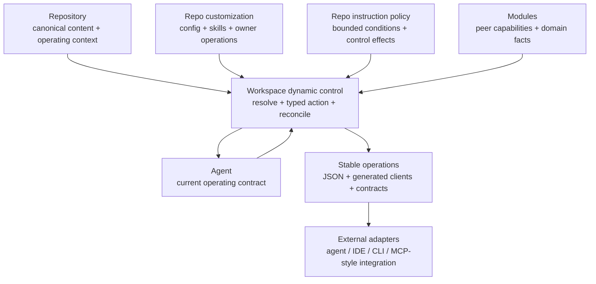

# Architecture

Agentic Workspace has a small architectural center: **repo operating context** and bounded **instruction policy** are dynamically composed into one current **operating contract** for the agent.

For the public product model, start with [Package overview](package/overview.md). For durable product intent, use [`SYSTEM_INTENT.md`](../SYSTEM_INTENT.md).

## Architectural shape


```mermaid
flowchart TD
    R[Repository\ncanonical content + operating context]
    IP[Repo instruction policy\nbounded conditions + control effects]
    C[Workspace dynamic control\nresolve + typed action + reconcile]
    A[Agent\ncurrent operating contract]
    M[Modules\npeer capabilities + domain facts]
    RC[Repo customization\nconfig + skills + owner operations]
    OP[Stable operations\nJSON + generated clients + contracts]
    X[External adapters\nagent / IDE / CLI / MCP-style integration]

    R --> C
    RC --> C
    IP --> C
    M --> C
    C --> A
    A --> C
    C --> OP
    OP --> X
```

The repository remains the source of truth. Workspace composes the current effect of relevant sources; the generated operating contract does not replace them.

## Operating context

Operating context is not a central store. It is the set of source-owned facts and procedures whose current or durable availability can materially change agent behavior.

Examples include system intent, architecture constraints, ownership, scoped instructions, repo policy, capability state, proof obligations, learned lessons, and current runtime facts. Different sources keep different owners and lifecycles.

Ordinary repository content does not become AW context merely because an agent might query it. Source code, canonical docs, tests, and history stay in their existing owners. A semantic index, RAG layer, knowledge graph, or other broad retrieval system would be a specialized capability layered onto AW rather than the architectural core.

## Dynamic control

The Workspace kernel owns the cross-cutting mechanics needed to turn relevant context and instruction policy into one current decision:

- source discovery, relevance, and provenance;
- compatibility/admission;
- bounded instruction applicability and effect composition;
- ownership and conflict visibility;
- allowed/forbidden effect and mutation boundaries;
- typed next actions and constructible recovery;
- proof/claim boundaries where applicable;
- result admission, continuation, and terminal-state composition;
- lifecycle coordination and degraded recovery;
- stable operation contracts for agents and external consumers.

This is implemented around the existing compiled operating decision and typed actions. It should remain one composition path, not a family of phase-specific decision engines.

## Instruction programming

AW should treat repository instructions as a small declarative program over authoritative context, not merely as static prose or a collection of hard-coded modes.

The internal normal form should be conceptually:

```text
facts + instruction clauses + capabilities
                    ↓
         operating-decision compiler
                    ↓
            operating contract
```

### Facts

Facts stay with their source owners: repo config, ownership, current work, proof/evidence, module state, runtime capability, target guidance, or other admitted context. An instruction system should reference those facts rather than copy them into another durable state store.

### Instruction clauses

A clause states **when** it applies and one or more bounded **control effects**. It should not contain arbitrary program logic or mutate state directly.

The useful common effect vocabulary is deliberately small:

- surface a context/resource reference;
- route a lazily loaded skill/procedure;
- nominate or require a typed operation;
- require evidence or an explicit human decision;
- restrict an effect or action class;
- limit a completion/claim class.

Specialized domains can author richer declarations when they need domain semantics, but overlapping applicability/effect behavior should compile to this shared internal form rather than requiring every subsystem to invent another control packet.

### Capabilities, skills, and operations

Skills contain reusable procedure. Typed operations contain effectful behavior, authority, inputs/results, and mutation semantics. Modules add domain facts and capabilities. Instruction clauses decide when those existing primitives matter; they do not replace them or create new mutation mechanisms.

### Composition laws

Instruction composition should be deterministic and authority-preserving:

- lower-authority input cannot widen a higher-authority permission or claim;
- restrictions and requirements compose conservatively;
- incompatible effects surface an explicit conflict/resolution owner instead of hidden order;
- missing referenced capabilities produce a bounded missing-capability route;
- clause/source revisions and matched facts remain visible in provenance;
- refreshing source facts invalidates only derived instruction decisions, not unrelated source-owned state.

Hard control should prefer typed facts and references over natural-language keyword inference. Keywords and semantic hints can remain useful for advisory discovery when their uncertainty is visible.

### Current versus intended boundary

AW already has specialized forms of programmable instruction: workflow obligations, assurance requirements/proof lanes, scoped instructions, skill activation/routing, target/correction guidance, configuration projection, and module relevance/contributions. The current runtime then normalizes many of their consequences into skill routes, allowed/forbidden actions, proof/claim boundaries, and next-safe actions.

Those existing forms are implementation evidence, not a requirement to publish all of them as one giant public DSL. The intended sequence is:

1. identify shared applicability/effect semantics;
2. compile them through one internal instruction normal form and the existing operating decision;
3. retain specialized authoring surfaces only where they carry useful domain meaning;
4. expose a small repo-authoring contract only where ordinary repositories demonstrably need to define new bounded control relationships.

This avoids both extremes: hard-coded Python policy for every new repo rule and a general-purpose workflow/rule engine.

## Generic operating loop

The conceptual loop is:

1. **Resolve** the smallest relevant operating contract from facts, applicable instruction policy, and capabilities.
2. **Act** through its supported operation, skill, owner, or human decision.
3. **Reconcile** the result into source-owned state, claim/continuation facts, and the next decision.

Startup, implementation, proof, handoff, closeout, and continuation are not independent architectural pillars. They are common situations in which the same loop exposes different relevant context and actions.

Closeout is terminal reconciliation.

## Module boundary

Modules are peer domain capabilities. They extend what the generic loop can know and do without redefining the loop.

The key separation is:

> **Modules describe their domain; Workspace owns the loop.**

`resolve`, `act`, and `reconcile` are kernel composition behavior, not three public callbacks that every module must implement.

A stable public module contract should reduce toward:

- identity, compatibility, and availability;
- owned state/resources/roots/effects;
- bounded relevance/activation;
- source-owned resources/context and lazily discoverable procedures;
- stable typed operations where the module has actions to expose;
- bounded typed result/effect semantics where the module produces state/evidence/blocker/residue/continuation effects;
- dependencies/conflicts and safe absence/removal where required.

Contribution dimensions are optional. A read-only module should not invent operations or reconciliation hooks. An operation-oriented module should not invent startup posture, a workflow phase, report slot, or closeout hook merely to satisfy the extension contract.

Workspace derives how admitted declarations participate in resolve/act/reconcile through the existing operating decision. The kernel should not infer semantics from module name, package layout, or similarity to a first-party module.

Modules may contribute facts and capabilities referenced by repo instruction policy, but they should not define new global instruction operators solely because the domain is new. That keeps module extensibility and repo programmability orthogonal and composable.

This also creates a practical extension boundary: adding an ordinary independent module should normally be module-package work plus its descriptor/contracts/tests. The module's identity should not require semantic Workspace runtime edits, core name lists/enums, fixed slot or phase registration, canonical-skill changes, proof/closeout branches, or another core-owned per-module registry entry. In-repo test/package wiring may exist, but it must not encode module-domain semantics; an out-of-tree module should be able to use the same public contract without changing the AW repository.

Planning, Memory, and Verification are current first-party examples:

- **Planning** owns active execution continuity and bounded intent;
- **Memory** owns learned anti-rediscovery repository knowledge;
- **Verification** owns reusable soft-verification protocols, evidence, and known gaps.

They may remain bundled for distribution convenience without receiving semantic privilege in the control kernel.

See [Modules](package/modules.md) and [Extensibility and public boundary](extension-boundary.md).

## Repo-customization boundary

A host repository can affect dynamic control without creating a reusable module.

Repo-owned config, workflow obligations, skills, canonical guidance, ownership, proof declarations, and deterministic repository operations can all contribute to the current operating contract.

This is the repository's programming surface for agent behavior. Its direction should be **small and effect-oriented**: new bounded condition-to-control relationships should not require Python changes, but the surface must not become a general prompt-personality language, arbitrary scripting host, scheduler, or workflow engine.

Machine-local preferences and capabilities remain lower-authority local inputs unless explicitly promoted. Local learned guidance can use the same internal control semantics at its lower authority without silently becoming checked-in repo policy.

### Instruction compilation normal form

Overlapping cross-cutting instruction mechanisms compile through one internal normal form before the existing operating-decision compiler resolves an action or blocker. Source owners project revision-bound facts; bounded clauses may only `surface`, `prefer`, `require`, or `restrict` existing capability, action, effect, evidence, human-decision, or claim references. There is no generic `allow`: ownership, operation, proof, repository, and human authorities remain the permission sources.

Conditions use a deliberately weak three-valued predicate model. Unknown enforcing applicability blocks only the matching action or claim while unrelated direct work remains cheap; advisory surfacing or preference stays inactive and diagnosable. The IR executes nothing, mutates nothing, and stores no generic obligations or repository knowledge.

Use the existing `instruction_clause_projection` selector to explain matched facts, source revisions, composed effects, satisfiers, conflicts, and the resulting bounded recovery. See the [schema reference](reference/instruction-clause-program.md) and [migration map](maintainer/instruction-clause-migration-map.md).

## External adapter boundary

External integrations are inverted: the adapter knows about AW and consumes stable AW operations; AW does not discover or manage the adapter.

An adapter may own transport, authentication, process/API/UI integration, event mapping, and disposable local state. It does not become repo policy, module state, proof, or completion authority merely by transporting information.

Core should not acquire an adapter registry, marketplace, credential store, or vendor-specific lifecycle.

## Progressive disclosure

Progressive disclosure is an architectural property, not only a documentation preference.

An irrelevant source, instruction clause, or installed module should not appear in the first-line operating contract. Deeper state, procedure, evidence, and diagnostics should be reachable by exact selector, skill, operation, or owner only when the current decision requires them.

Adding capabilities or repo policy should not proportionally enlarge first contact.

## Public versus internal programming surface

Internal runtime machinery may be broad. Public compatibility should cover only stable semantics needed for safe independent composition and repo-owned control.

A lifecycle hook, workflow phase, renderer packet, posture fragment, report slot, startup fragment, proof/closeout hook, arbitrary callback, or current specialized packet is not automatically a public instruction primitive because it exists internally.

For every public control field, ask whether the repository needs it to express a durable condition/effect relationship or whether it merely exposes current AW choreography. The latter should normally be derived or remain internal.

## Monorepo boundary

In this source repository:

- `.agentic-workspace/` is the live repo-native operating enclave;
- `packages/planning/`, `packages/memory/`, and `packages/verification/` contain first-party module implementation source, payloads, tests, and fixtures;
- generated projections are derived and must not become competing semantic authority;
- maintainer tooling, dogfooding evidence, and source-checkout procedure remain repo-specific unless a portability argument promotes them.

## Design test

A change fits this architecture when it makes AW better at preserving control-relevant context, expressing bounded repo-owned control, resolving the current operating contract, acting through a supported route, reconciling results, or extending those abilities through a peer module—without enlarging the ordinary mental model unnecessarily.

Question a change when it:

- creates a general repository knowledge store in core;
- introduces another decision packet or compiler beside the compiled operating decision;
- requires a Python/runtime branch solely to express a new ordinary repo condition-to-control relationship that fits existing safe effects;
- creates arbitrary script/callback/loop semantics instead of a bounded declarative control effect;
- exposes current stages, posture knobs, packet fields, or hidden precedence as the public instruction language;
- requires Workspace to learn a module's identity/domain logic unnecessarily;
- makes an independent module author register AW-specific phases, slots, posture fragments, or empty loop hooks rather than describe the capability itself;
- requires a central per-module core edit merely to recognize a new independent module;
- exposes irrelevant capability or policy context at first contact;
- adds a new workflow phase, policy concept, or command where an existing resolve/act/reconcile route would suffice;
- gives adapter transport or module-local success broader authority than its owner permits;
- preserves old and new abstractions in parallel rather than deriving or removing one.
