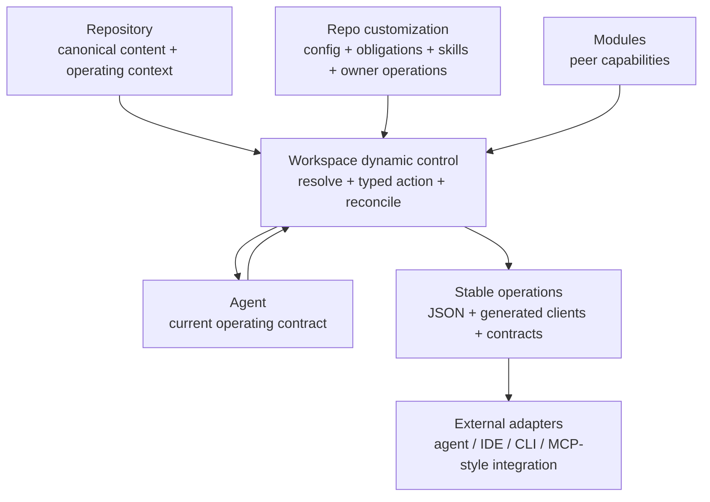

# Architecture

Agentic Workspace has a small architectural center: **repo operating context** is dynamically composed into one current **operating contract** for the agent.

For the public product model, start with [Package overview](package/overview.md). For durable product intent, use [`SYSTEM_INTENT.md`](../SYSTEM_INTENT.md).

## Architectural shape

```mermaid
flowchart TD
    R[Repository\ncanonical content + operating context]
    C[Workspace dynamic control\nresolve + typed action + reconcile]
    A[Agent\ncurrent operating contract]
    M[Modules\npeer capabilities]
    RC[Repo customization\nconfig + obligations + skills + owner operations]
    OP[Stable operations\nJSON + generated clients + contracts]
    X[External adapters\nagent / IDE / CLI / MCP-style integration]

    R --> C
    RC --> C
    M --> C
    C --> A
    A --> C
    C --> OP
    OP --> X
```

The repository remains the source of truth. Workspace composes the current effect of relevant sources; the generated operating contract does not replace them.

## Operating context

Operating context is not a central store. It is the set of source-owned facts and procedures whose current or durable availability can materially change agent behavior.

Examples include system intent, architecture constraints, ownership, scoped instructions, repo policy, capability state, proof obligations, learned lessons, and current runtime facts. Different sources keep different owners and lifecycles.

Ordinary repository content does not become AW context merely because an agent might query it. Source code, canonical docs, tests, and history stay in their existing owners. A semantic index, RAG layer, knowledge graph, or other broad retrieval system would be a specialized capability layered onto AW rather than the architectural core.

## Dynamic control

The Workspace kernel owns the cross-cutting mechanics needed to turn relevant context into one current decision:

- source discovery, relevance, and provenance;
- compatibility/admission;
- ownership and conflict visibility;
- allowed/forbidden effect and mutation boundaries;
- typed next actions and constructible recovery;
- proof/claim boundaries where applicable;
- result admission, continuation, and terminal-state composition;
- lifecycle coordination and degraded recovery;
- stable operation contracts for agents and external consumers.

This is implemented around the existing compiled operating decision and typed actions. It should remain one composition path, not a family of phase-specific decision engines.

## Generic operating loop

The conceptual loop is:

1. **Resolve** the smallest relevant operating contract.
2. **Act** through its supported operation, skill, owner, or human decision.
3. **Reconcile** the result into source-owned state, claim/continuation facts, and the next decision.

Startup, implementation, proof, handoff, closeout, and continuation are not independent architectural pillars. They are common situations in which the same loop exposes different relevant context and actions.

Closeout is terminal reconciliation.

## Module boundary

Modules are peer domain capabilities. They extend what the generic loop can know and do without redefining the loop.

A stable module contract should be small enough to describe:

- identity, compatibility, and availability;
- relevance/activation;
- source-owned state/resources and writable/effect ownership;
- compact resolve contributions such as context/procedure/constraint references;
- stable typed operations for action;
- bounded reconcile results such as domain state, evidence, residue, or continuation facts;
- lifecycle, dependencies, conflicts, absence, and removal.

The kernel should not infer semantics from module name, package layout, or similarity to a first-party module.

Planning, Memory, and Verification are current first-party examples:

- **Planning** owns active execution continuity and bounded intent;
- **Memory** owns learned anti-rediscovery repository knowledge;
- **Verification** owns reusable soft-verification protocols, evidence, and known gaps.

They may remain bundled for distribution convenience without receiving semantic privilege in the control kernel.

See [Modules](package/modules.md) and [Extensibility and public boundary](extension-boundary.md).

## Repo-customization boundary

A host repository can affect dynamic control without creating a reusable module.

Repo-owned config, workflow obligations, skills, canonical guidance, ownership, proof declarations, and deterministic repository operations can all contribute to the current operating contract.

This is the repository's programming surface for agent behavior. It should express real policy, authority, capability selection, or durable operating choices—not become a general prompt-personality or rule-engine framework.

Machine-local preferences and capabilities remain lower-authority local inputs unless explicitly promoted.

## External adapter boundary

External integrations are inverted: the adapter knows about AW and consumes stable AW operations; AW does not discover or manage the adapter.

An adapter may own transport, authentication, process/API/UI integration, event mapping, and disposable local state. It does not become repo policy, module state, proof, or completion authority merely by transporting information.

Core should not acquire an adapter registry, marketplace, credential store, or vendor-specific lifecycle.

## Progressive disclosure

Progressive disclosure is an architectural property, not only a documentation preference.

An irrelevant source or installed module should not appear in the first-line operating contract. Deeper state, procedure, evidence, and diagnostics should be reachable by exact selector, skill, operation, or owner only when the current decision requires them.

Adding capabilities should not proportionally enlarge first contact.

## Public versus internal extension surface

Internal runtime machinery may be broad. Public extension compatibility should cover only stable semantics needed for independent composition.

A lifecycle hook, workflow phase, renderer packet, posture fragment, or callback is not automatically a public primitive because it exists internally. Prefer declarative relevance, ownership, operations, and bounded result semantics over a generic callback framework.

## Monorepo boundary

In this source repository:

- `.agentic-workspace/` is the live repo-native operating enclave;
- `packages/planning/`, `packages/memory/`, and `packages/verification/` contain first-party module implementation source, payloads, tests, and fixtures;
- generated projections are derived and must not become competing semantic authority;
- maintainer tooling, dogfooding evidence, and source-checkout procedure remain repo-specific unless a portability argument promotes them.

## Design test

A change fits this architecture when it makes AW better at preserving control-relevant context, resolving the current operating contract, acting through a supported route, reconciling results, or extending those abilities through a peer module—without enlarging the ordinary mental model unnecessarily.

Question a change when it:

- creates a general repository knowledge store in core;
- introduces another decision packet or phase-specific authority beside the compiled operating decision;
- requires Workspace to learn a module's identity/domain logic unnecessarily;
- exposes irrelevant capability context at first contact;
- adds a new workflow phase, policy concept, or command where an existing resolve/act/reconcile route would suffice;
- gives adapter transport or module-local success broader authority than its owner permits;
- preserves old and new abstractions in parallel rather than deriving or removing one.